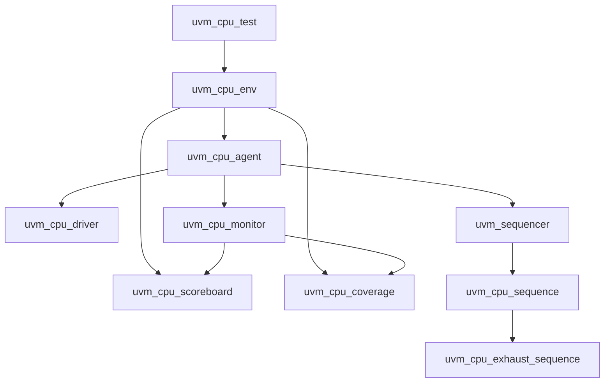

# SimpleCPU UVM Verification

This project implements a comprehensive UVM (Universal Verification Methodology) based verification environment for a simple 16-bit CPU (SimpleCPU). The verification suite ensures the correctness of the CPU's instruction set through automated testing, functional coverage, and scoreboard-based checking.

## Project Purpose

The SimpleCPU is a basic 16-bit processor supporting a subset of ARM-like instructions. This verification project aims to:

- Validate the functional correctness of all supported CPU instructions
- Achieve high functional coverage through directed and random test sequences
- Demonstrate UVM best practices for digital design verification
- Provide a reusable framework for CPU verification

## Supported Instructions

The verification environment tests the following CPU instructions:

- **MOV_IMM**: Move immediate value to register (8-bit sign-extended)
- **MOV_SHIFT**: Move shifted register value to another register
- **ADD**: Add two registers with optional shift
- **CMP**: Compare two registers (sets flags only)
- **AND**: Bitwise AND of two registers
- **MVN**: Bitwise NOT of a shifted register

All instructions support shift operations: LSL (Logical Shift Left), LSR (Logical Shift Right), ASR (Arithmetic Shift Right), and NONE.

## Architecture Overview

The verification environment follows UVM methodology with the following components:

- **uvm_cpu_test**: Top-level test class that instantiates the environment
- **uvm_cpu_env**: Environment containing agent, scoreboard, and coverage collector
- **uvm_cpu_agent**: Active agent with driver, monitor, and sequencer
- **uvm_cpu_driver**: Drives instructions to the DUT via BFM
- **uvm_cpu_monitor**: Observes DUT responses and sends transactions to scoreboard/coverage
- **uvm_cpu_scoreboard**: Self-checking scoreboard that predicts and verifies DUT behavior
- **uvm_cpu_coverage**: Functional coverage collector for instruction and data patterns
- **uvm_cpu_exhaust_sequence**: Comprehensive test sequence covering all instruction combinations

### UVM Component Hierarchy



## Prerequisites

- **Questasim/ModelSim**: HDL simulator with UVM support
- **UVM Library**: Ensure UVM is properly installed and configured
- **SystemVerilog**: Full support for UVM constructs

## Project Structure

```
SimpleCPU_uvm_verif/
├── BFM.sv                 # Bus Functional Model interface
├── DUT.sv                 # CPU Design Under Test
├── uvm_top.sv            # Top-level testbench module
├── uvm_classes/
│   ├── uvm_cpu_pkg.sv    # Package containing all UVM classes
│   ├── uvm_cpu_transaction.sv
│   ├── uvm_cpu_driver.sv
│   ├── uvm_cpu_monitor.sv
│   ├── uvm_cpu_scoreboard.sv
│   ├── uvm_cpu_coverage.sv
│   ├── uvm_cpu_agent.sv
│   ├── uvm_cpu_env.sv
│   ├── uvm_cpu_test.sv
│   └── sequences/
│       └── uvm_cpu_exhaust_sequence.sv
├── CPU_Specification.docx # CPU specification document
└── README.md
```

## Setup and Compilation

1. **Clone or download** the project to your local machine.

2. **Open Questasim/ModelSim** and create a new project or use the existing `.mpf` file.

3. **Compile the design files** in the following order:
   ```
   vlog BFM.sv
   vlog DUT.sv
   vlog uvm_classes/uvm_cpu_pkg.sv
   vlog uvm_top.sv
   ```

4. **Compile the UVM library** if not already done:
   ```
   vlog -sv $UVM_HOME/src/uvm_pkg.sv
   ```

## Running the Simulation

### Command Line Mode
```
vsim -c uvm_top -do "run -all; quit"
```

### GUI Mode (for debugging and waveform viewing)
```
vsim -gui -voptargs=+acc -vopt -l mti.log work.uvm_top
```

The test will automatically run the exhaustive sequence, which includes:
- Directed tests for each instruction type
- Boundary condition testing
- Random instruction sequences
- Coverage-driven verification

## Viewing Results

- **Transcript**: Check the simulation log for UVM messages, pass/fail status, and coverage reports
- **Waveforms**: Use the GUI mode to inspect signal timing and DUT behavior
- **Coverage Reports**: Questasim provides functional coverage metrics

## Test Sequences

The main test sequence (`uvm_cpu_exhaust_sequence`) executes:
- Individual instruction tests with various operands
- Flag verification for comparison operations
- Register state validation
- Reset functionality testing
- Random instruction generation for coverage

## Customization

To modify or extend the verification:

1. **Add new instructions**: Update `instr_t` enum in `uvm_cpu_pkg.sv` and extend scoreboard logic
2. **Modify test sequences**: Edit `uvm_cpu_exhaust_sequence.sv` to add new test cases
3. **Adjust coverage goals**: Update `uvm_cpu_coverage.sv` with additional coverpoints

## Troubleshooting

- **Compilation errors**: Ensure all files are in the correct include path
- **UVM not found**: Verify UVM installation and library compilation
- **Simulation hangs**: Check DUT connectivity and BFM timing
- **Coverage not met**: Review test sequences for missing scenarios

## Contributing

This project serves as an educational example of UVM verification. Contributions for improvements, additional test cases, or documentation enhancements are welcome.